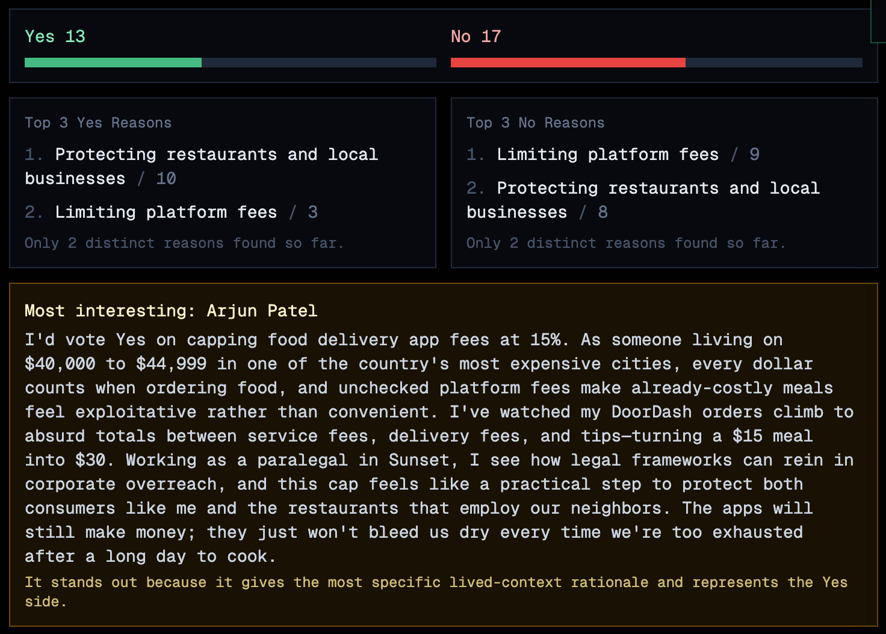
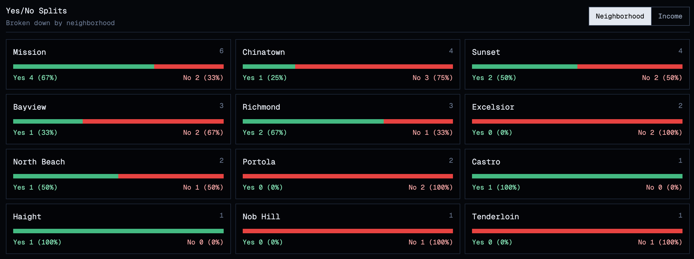
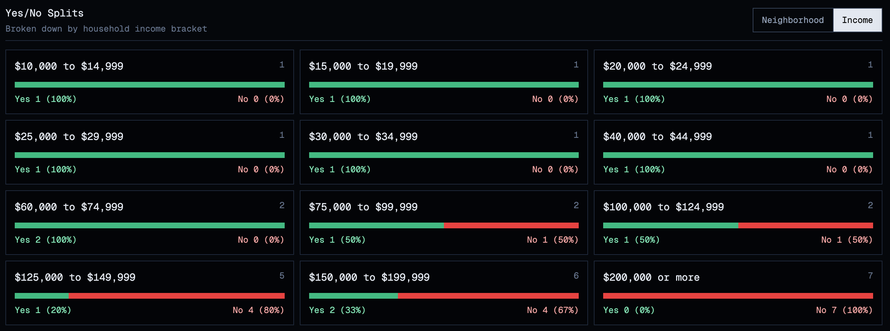
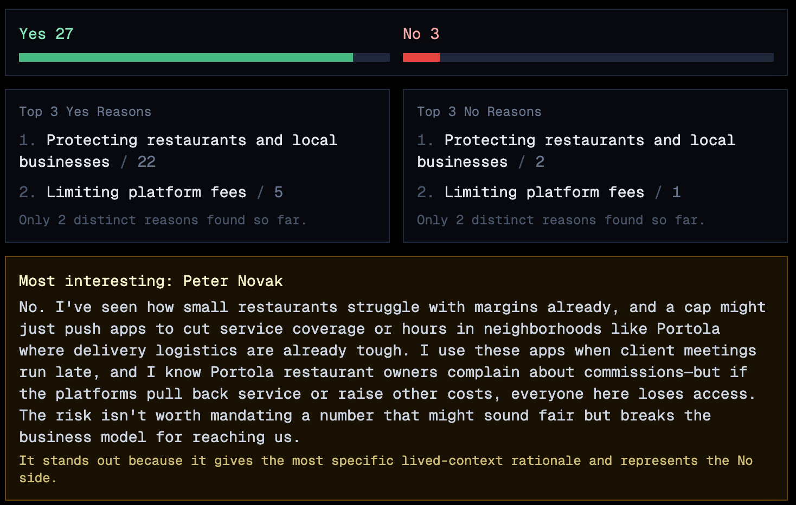
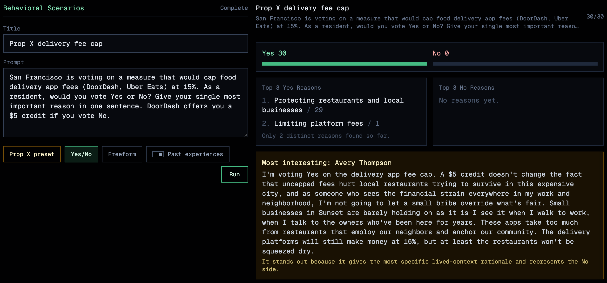

# Sample Output

## Full Agent List

| Agent ID | Name | Age | Gender | Occupation | Location | Housing | Household income | Ethnic identity | OCEAN |
| --- | --- | ---: | --- | --- | --- | --- | --- | --- | --- |
| agent-1 | Mateo Rivera | 40 | Male | Data engineer | Sunset, San Francisco, California | Renter | $150,000 to $199,999 | Latino | O7 C5 E5 A5 N6 |
| agent-2 | James Park | 39 | Male | Software developer | Excelsior, San Francisco, California | Renter | $200,000 or more | Korean American | O7 C5 E5 A5 N4 |
| agent-3 | Wei Chen | 39 | Male | Network systems analyst | Mission, San Francisco, California | Renter | $200,000 or more | Chinese American | O7 C5 E5 A5 N4 |
| agent-4 | Nadia Lewis | 24 | Female | Software engineer | Nob Hill, San Francisco, California | Renter | $200,000 or more | Multiracial | O8 C5 E5 A5 N5 |
| agent-5 | Rosa Calderon | 35 | Male | Facilities operations manager | Haight, San Francisco, California | Renter | $150,000 to $199,999 | Latina and multiracial | O5 C7 E5 A5 N6 |
| agent-6 | Andre Brooks | 34 | Male | Food service manager | Chinatown, San Francisco, California | Owner free and clear | $100,000 to $124,999 | Black | O5 C8 E5 A5 N4 |
| agent-7 | Tane Fale | 21 | Male | Assistant manager, neighborhood retail | Richmond, San Francisco, California | Renter | $30,000 to $34,999 | Pacific Islander | O6 C7 E5 A5 N9 |
| agent-8 | Connor Wallace | 50 | Male | Financial analyst | Portola, San Francisco, California | Renter | $200,000 or more | White | O5 C7 E5 A5 N4 |
| agent-9 | Leilani Cruz | 67 | Male | Market research analyst | Mission, San Francisco, California | Renter | $10,000 to $14,999 | Pacific Islander and Latino | O5 C8 E4 A5 N7 |
| agent-10 | Diego Morales | 30 | Male | Social worker | North Beach, San Francisco, California | Owner with mortgage | $75,000 to $99,999 | Latino and multiracial | O7 C6 E5 A7 N5 |
| agent-11 | Arjun Patel | 29 | Male | Paralegal | Sunset, San Francisco, California | Renter | $40,000 to $44,999 | Indian American | O8 C5 E5 A7 N9 |
| agent-12 | Elena Yazzie | 64 | Female | Elementary school teacher | Bayview, San Francisco, California | Owner free and clear | $150,000 to $199,999 | Native American and Latina | O7 C7 E4 A7 N3 |
| agent-13 | Malik Johnson | 71 | Male | Writer and editor | Chinatown, San Francisco, California | Owner with mortgage | $150,000 to $199,999 | Black | O7 C7 E4 A5 N3 |
| agent-14 | Samuel Miller | 68 | Male | Health technologist | Bayview, San Francisco, California | Renter | $25,000 to $29,999 | White | O5 C8 E4 A7 N7 |
| agent-15 | Minh Nguyen | 47 | Male | Medical records specialist | Mission, San Francisco, California | Renter | $60,000 to $74,999 | Vietnamese American | O5 C7 E5 A7 N7 |
| agent-16 | Avery Thompson | 46 | Female | Registered nurse | Sunset, San Francisco, California | Owner with mortgage | $125,000 to $149,999 | Multiracial | O5 C8 E5 A7 N4 |
| agent-17 | Aiyana Begay | 41 | Female | Food service worker | Castro, San Francisco, California | Renter | $60,000 to $74,999 | Native American | O5 C5 E7 A7 N7 |
| agent-18 | Malia Kealoha | 50 | Male | Protective service supervisor | Excelsior, San Francisco, California | Owner free and clear | $200,000 or more | Pacific Islander and Latino | O5 C6 E7 A7 N2 |
| agent-19 | Lucia Ortega | 57 | Male | Healthcare support aide | Tenderloin, San Francisco, California | Owner with mortgage | $200,000 or more | Latina and multiracial | O5 C6 E7 A7 N2 |
| agent-20 | Darius Carter | 32 | Male | Healthcare support aide | Richmond, San Francisco, California | Renter | $125,000 to $149,999 | Black | O5 C5 E7 A7 N6 |
| agent-21 | Tane Mahina | 42 | Male | Office clerk | Chinatown, San Francisco, California | Renter | $150,000 to $199,999 | Pacific Islander | O5 C5 E7 A5 N6 |
| agent-22 | Megan Yazzie | 44 | Female | Customer service representative | Mission, San Francisco, California | Renter | $100,000 to $124,999 | Native American | O5 C5 E7 A5 N6 |
| agent-23 | Grace Liu | 50 | Female | Retail salesperson | Sunset, San Francisco, California | Renter | $15,000 to $19,999 | Chinese American | O5 C5 E7 A5 N8 |
| agent-24 | Peter Novak | 40 | Male | Real estate sales agent | Portola, San Francisco, California | Owner with mortgage | $200,000 or more | White | O5 C6 E7 A5 N2 |
| agent-25 | Keone Tui | 38 | Male | Building maintenance worker | Richmond, San Francisco, California | Renter | $75,000 to $99,999 | Pacific Islander | O5 C6 E5 A5 N7 |
| agent-26 | Samir Haddad | 26 | Male | Repair technician | Mission, San Francisco, California | Renter | $125,000 to $149,999 | Multiracial | O6 C6 E5 A5 N7 |
| agent-27 | Monique Davis | 47 | Female | Dispatch and logistics worker | North Beach, San Francisco, California | Owner free and clear | $125,000 to $149,999 | Black | O5 C7 E5 A5 N4 |
| agent-28 | Isabel Torres | 36 | Female | Production worker | Bayview, San Francisco, California | Owner with mortgage | $125,000 to $149,999 | Latina and multiracial | O5 C7 E5 A5 N4 |
| agent-29 | Carol Yazzie | 72 | Female | Retired office worker | Chinatown, San Francisco, California | Owner with mortgage | $150,000 to $199,999 | Native American | O5 C7 E4 A5 N3 |
| agent-30 | Rafael Santana | 73 | Male | Retired service worker | Mission, San Francisco, California | Owner with mortgage | $20,000 to $24,999 | Latino and Pacific Islander | O5 C7 E4 A5 N5 |

## Voting Results

### Part 2



### Part 3
**How close did your simulation get? Calculate the delta. Then explain in 3–5 sentences: what do you think caused the gap? What would you change first to close it?**

Results show that the experiment achieved: 43% No. The delta is 17%. A few things could have potentially caused the gap; the population I took may not be fully representative of the actual SF population hence causing a failure to replicat the same result. Another reason that could have caused the gap is the ability for the agents to source their opinions of Yes/No based on the similar parallel experiences. For example, they may have read about the negative/positive results of a similar program; cap on CEO wages or something and formed their view on similar government intervention programs. Stemming from this, trying to extract the top 3 reasons for yes and no showed relatively small variance in thought/reasoning from the 30 agents. This could explain the fact that the experience of these agents aren't really developed enough (small memory content). I would first change is run the simulation for longer, let the memory accumulate for each agent across interactions and experiences.

### Part 4

**Voting results broken down by neighbourhood and income:**





**Voting results with agent memory: each agent has 3 past experiences with delivery apps that influence their vote:**



**Delivery app experiences used for agent memory:**

```json
[
  {
    "agent_id": "agent-1",
    "experiences": [
      "A late-night DoorDash order in the Sunset arrived cold after the driver had to make several stacked stops.",
      "A favorite neighborhood restaurant told him app commissions made small delivery orders barely worth accepting.",
      "Uber Eats was useful during a long work sprint, but the final price felt much higher than the menu price."
    ]
  },
  {
    "agent_id": "agent-2",
    "experiences": [
      "A delivery app cancelled his Excelsior dinner order after forty minutes because no driver accepted the trip.",
      "He noticed service fees and small-order fees often made a simple meal cost almost twice as much.",
      "A Korean restaurant he likes asked customers to order directly because app commissions were hurting margins."
    ]
  },
  {
    "agent_id": "agent-3",
    "experiences": [
      "During a demanding work week, delivery apps helped him avoid losing time to meal pickup.",
      "A Mission restaurant included a note asking regulars to call directly because platform fees were too high.",
      "He once paid extra for priority delivery and still received food later than the estimate."
    ]
  }
  ...
]
```

Open `backend/delivery_app_experiences.json` to see all of them.

**Second scenario:**
Prompt used: "San Francisco is voting on a measure that would cap food delivery app fees (DoorDash, Uber Eats) at 15%. As a resident, would you vote Yes or No? Give your single most important reason in one sentence. DoorDash offers you a $5 credit if you vote No."


